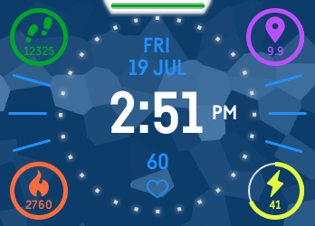
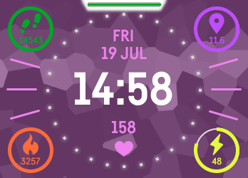
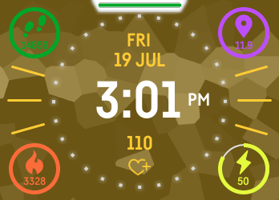

# Maritime  

##### Version 2.0  

Maritime is a Fitbit Ionic clock face that shows stats as circles that close as goals are reached. 
It also displays heart rate and battery level at a glance. 

It's also open source (because I know how much that can help beginners)!  

###### If you're on mobile, you can use the below link to open the Fitbit app gallery directly to this watch face:
###### https://gallery.fitbit.com/details/b80f2af2-91c5-4394-a47b-ab9368904bcd

### Features
📅 Day of the week and date  
🔋 Battery level bar that changes color as percentage lowers  
❤ Heart rate with matching icon based on zone (resting, fat burn, cardio/peak)  
🏅 Fitness goal progress displayed as circles (with units based on user preferences)  
🎨 Customizable background color with 13 presets!  

### Screenshots
| Example 1 | Example 2 | Example 3 |
| --------- | --------- | --------- |
|  |  |  |  

🙋🏽‍♂️ If you enjoy this app, please consider helping a broke college student (me)! https://www.buymeacoffee.com/ishfulthinking